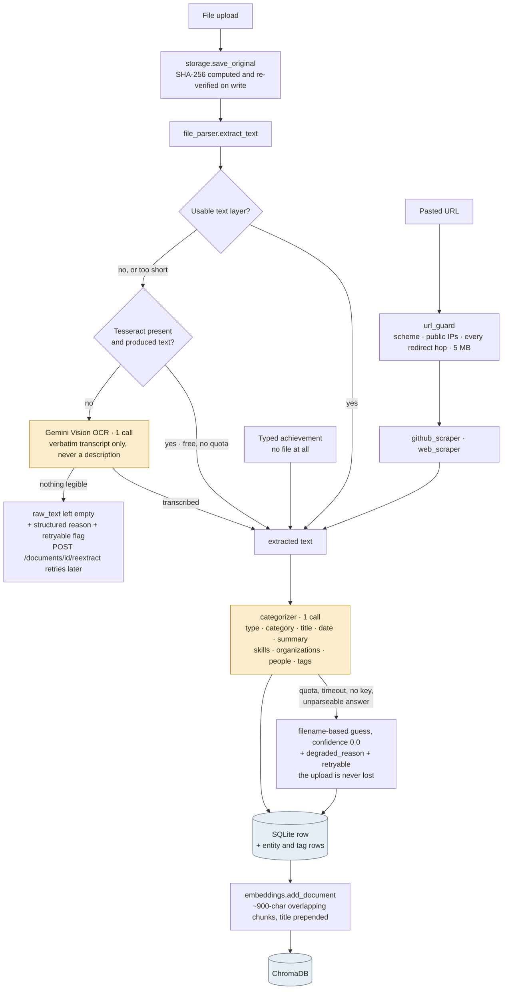
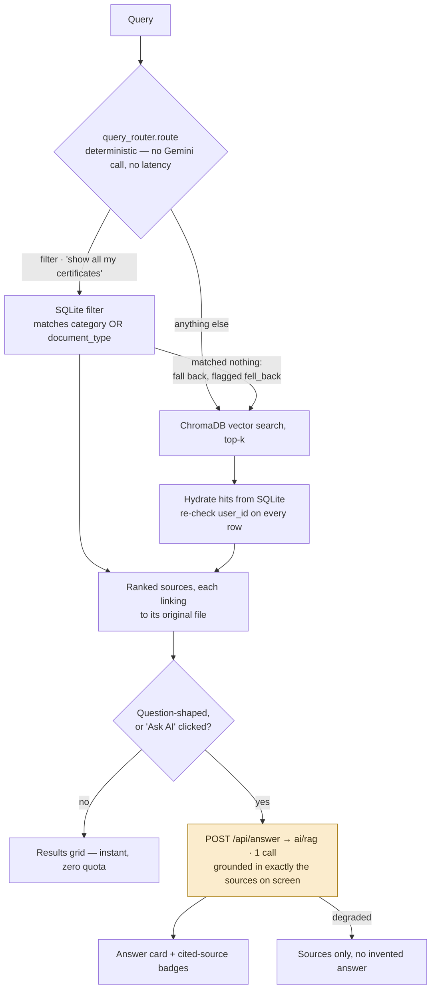

# Architecture

Three views of the same system: what the pieces are, how a document gets *in*,
and how a question gets *answered*. Drawn from the code rather than from the
sketch in [plan.md §3](../plan.md) — where the two disagree, these are right.

For *why* each of these is shaped the way it is, see
[engineering-notes.md](engineering-notes.md).

---

## System

```mermaid
flowchart TB
    subgraph browser["Browser · React + Vite · deployed on Vercel"]
        views["Four views, one nav, no router<br/>Timeline · Graph · Search · Upload"]
        client["api/client.js<br/>every call carries X-User-Id"]
        views --> client
    end

    subgraph api["FastAPI · deployed on Render"]
        ident["identity.current_user<br/>X-User-Id → user_id, strict allowlist"]
        routes["Routes<br/>/upload · /ingest-url · /ingest-text · /documents<br/>/search · /answer · /graph · /career-paths · /seed-demo"]

        subgraph ingest["Ingestion"]
            parser["file_parser<br/>PDF · DOCX · PPTX · TXT · images"]
            ocr["ocr_handler<br/>local Tesseract first, Gemini Vision second"]
            scraper["url_scraper → github_scraper · web_scraper"]
            guard["url_guard · the SSRF gate<br/>scheme · public IPs only · every redirect hop · 5 MB cap"]
            parser --> ocr
            scraper --> guard
        end

        subgraph aimod["AI layer"]
            cat["categorizer"]
            vis["vision"]
            career["career_path"]
            ragm["rag"]
            limiter["ai/gemini.py<br/>ONE shared 13s rate limiter · key redaction<br/>every caller degrades, none raises"]
            embed["embeddings · MiniLM-L6-v2<br/>ONNX, local, free, not rate-limited"]
            cat --> limiter
            vis --> limiter
            career --> limiter
            ragm --> limiter
        end

        builder["graph/builder<br/>skill and similar_to edges computed on read"]
        ident --> routes
        routes --> parser
        routes --> scraper
        routes --> cat
        routes --> ragm
        routes --> career
        routes --> embed
        routes --> builder
        ocr --> vis
        builder --> embed
    end

    subgraph stores["Storage on the API host · ephemeral on the free tier"]
        files[("uploads/user_id/<br/>originals, byte-for-byte<br/>+ .meta.json sidecar")]
        sql[("SQLite · source of truth<br/>documents · entities · tags · career_paths")]
        chroma[("ChromaDB · derived cache<br/>rebuildable from raw_text")]
    end

    client -- "HTTPS · CORS allowlist" --> ident
    limiter -- "5 per minute · 20 per day" --> gemini[["Gemini 3 Flash API"]]
    guard -- "GitHub REST · public web" --> internet[["The internet"]]
    routes -- "save_original, checksum verified" --> files
    files -. "read only, never written again" .-> parser
    routes --> sql
    builder --> sql
    embed --> chroma
    sql -. "startup sync · full rebuild" .-> chroma

    classDef ext fill:#f2e8d8,stroke:#8a7355,color:#2f2620
    classDef store fill:#e7edf4,stroke:#5b6b7f,color:#22303f
    class gemini,internet ext
    class files,sql,chroma store
```

Two things in that picture carry most of the design:

- **The original is written once and only ever read afterwards** (the dashed
  arrow back out of `uploads/`). Everything the AI produces lands somewhere else,
  which is what makes re-extraction and integrity verification possible at all.
- **Four Gemini callers, one rate limiter.** The free-tier budget is per *key*,
  not per module. Embeddings deliberately sit outside it: they run locally, cost
  nothing, and must stay fast.

---

## Ingestion — how a document gets in

Every input converges on the same text → categorize → store → embed spine, so a
typed sentence and a scanned certificate become the same kind of record.

Amber marks the two steps that spend from the **20-calls-per-day** budget — the
constraint the whole design is shaped around. A text-layer PDF costs one call; a
scan costs two, and ~26s at 13s spacing.

---

## Retrieval — how a question gets answered

Query *understanding* is deterministic; Gemini is reserved for answer
*synthesis*. That split is why search stays instant, why a filter query costs no
quota, and why an answer can only ever cite documents the user can already see.
